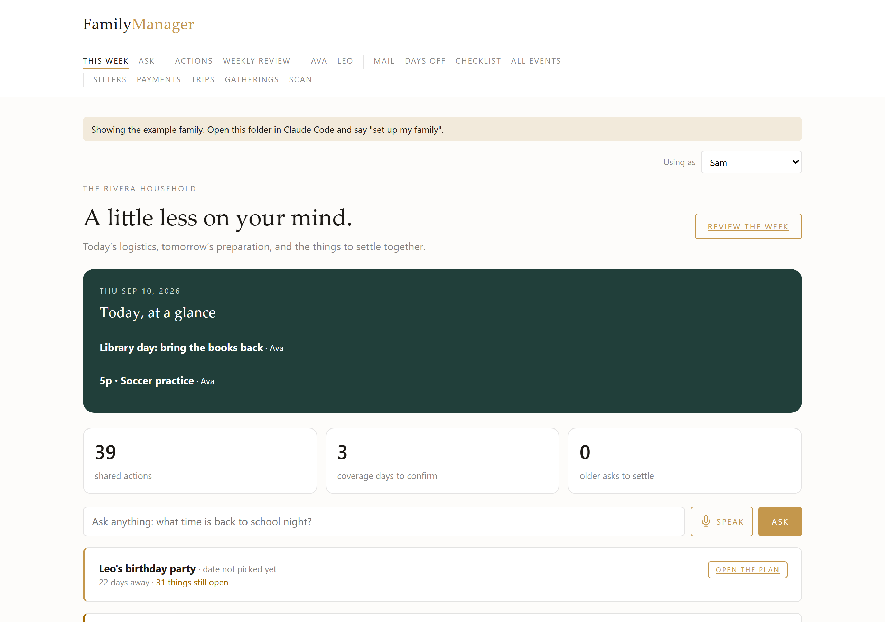
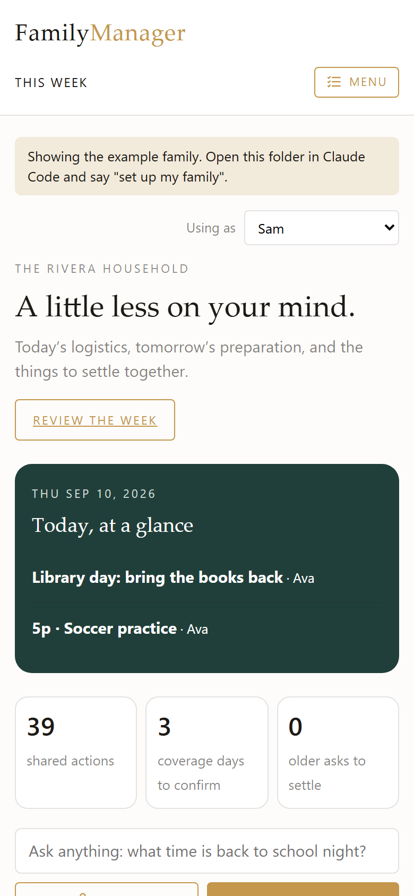

# Family Manager

A household mental-load manager that runs on your own machine. It reads the school mail, opens every attachment and link, merges your calendars, tracks who's covering each day the kids are out, and answers questions about all of it in plain words.

Built for one family's real use. It's shared here as a template you set up with Claude Code.

<p>
  
  
</p>

The screenshots show the fictional example family that ships with the app.

## Why it's built this way

Family apps that extract dates from email tend to fail the same way: small mistakes pile up. A wrong date here, a missed schedule change there, until checking the app is more work than reading the mail. This one is built around not trusting a single extraction:

- **Three states, never two.** Every feed reports found, not found, or couldn't look. A failed fetch never renders as a quiet day.
- **One happening, one row.** A closure that arrives from the school email, the district and a calendar invite shows once.
- **It refuses instead of guessing.** A half day is never booked as a day off. An event can't go on the calendar with nobody covering it.
- **The model proposes, you apply.** The assistant can suggest adding a payment or a checklist item. Nothing changes until a parent presses Apply.
- **It flags a stale login.** An expired password or token shows up as a failed step, not a feed that goes quiet.

[docs/RELIABILITY.md](docs/RELIABILITY.md) has the specific failures behind each rule.

## What it does

| Page | What it's for |
| --- | --- |
| This week | Every event across school mail and calendars, deduplicated, with what needs you |
| Mail | Each school email read in full, attachments and links included, with a briefing and action items |
| Kids | One page per kid: their events, their week at school |
| Days off | Every day a kid is out, who's covering it, and one press to put it on the calendar |
| Checklist | A shared list that records who ticked what |
| Payments | Tuition, camps and activities: amount, who with, and when it's due |
| Gatherings | Birthday parties and visits: the plan, the guest list, next year's copy |
| Sitters | The rotation and the sheet a sitter needs |
| Trips | Plans, bookings, drive times, the forecast, and what it actually cost |
| Ask | Plain-words questions and changes, by voice or text, with documents attached |

Every table downloads as a spreadsheet.

## Set it up

You need Python 3.11+ and, for the AI features, [Claude Code](https://claude.com/claude-code) signed in to your Claude account. Without it, briefings fall back to plain extraction and Ask shows its matches without an answer.

```bash
git clone <this repo>
cd family-manager
pip install -r requirements.txt
python demo_seed.py  # optional: a few weeks of the example family's school stuff
python app.py        # http://127.0.0.1:5088
```

Then open the folder in Claude Code and say **"set up my family."** It asks about your household, writes `data/household.json`, walks you through the Gmail app password and calendar access, runs the first mail check, and schedules the nightly run. [CLAUDE.md](CLAUDE.md) is the script it follows, and you can follow it by hand.

## Privacy

- Everything lives in `data/` on your machine, which git ignores.
- Mail is read over IMAP with an app password you create and can revoke.
- AI calls go through the `claude` command on your own login. An API key left in your environment is stripped so it can't be billed by accident.
- `python claude_headless.py --costs` shows what the model calls have cost.

## Hosted version

If you'd rather not run it yourself, a hosted version is being considered. Join the waitlist: https://docs.google.com/forms/d/1gacwdiC1ziKTAU8uzfhwI6tfVRwr_6eKwwYXjKZdvsE/viewform

## License

MIT. See [LICENSE](LICENSE).
